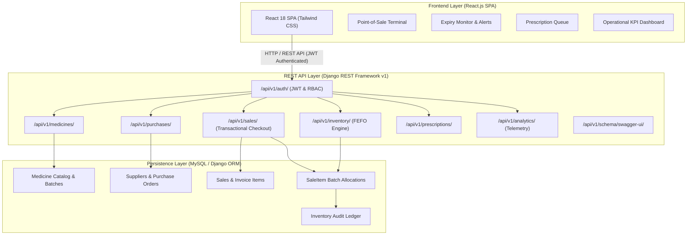
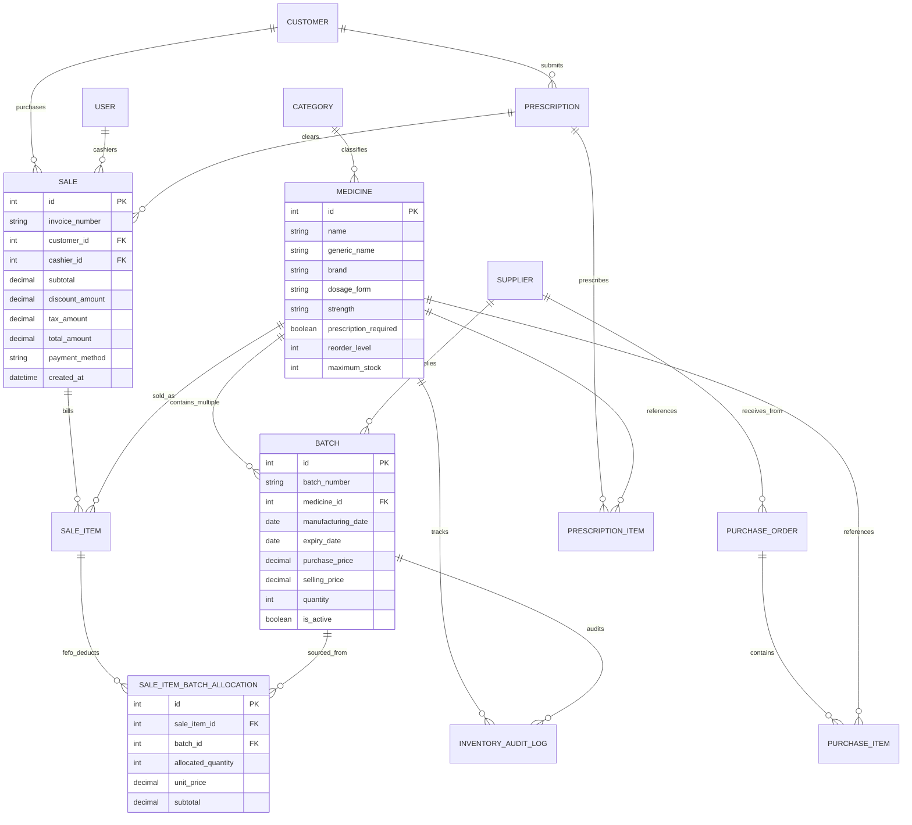

# 🚀 MediStock — Intelligent Medical Store & Pharmacy Management Platform

> ### 🌐 Live Cloud Deployment
> - **Production URL**: **[https://medistock-0irl.onrender.com](https://medistock-0irl.onrender.com)**
> - **Swagger API Documentation**: **[https://medistock-0irl.onrender.com/api/v1/schema/swagger-ui/](https://medistock-0irl.onrender.com/api/v1/schema/swagger-ui/)**
> - **Demo Credentials**: 
>   - **Admin**: `admin` / `admin123`
>   - **Pharmacist**: `pharmacist` / `pharma123`
>   - **Inventory**: `inventory` / `inv123`
>   - *(Or use the 1-click Role Switcher inside the UI)*

[](https://medistock-0irl.onrender.com)
[](https://medistock-0irl.onrender.com/api/v1/schema/swagger-ui/)

[](https://www.python.org/)
[](https://www.djangoproject.com/)
[](https://www.django-rest-framework.org/)
[](https://react.dev/)
[-brightgreen.svg)](https://pytest.org/)
[](https://www.docker.com/)

MediStock is an enterprise-grade medical store and pharmacy operations platform engineered with **Django REST Framework**, **MySQL/Django ORM**, and **React.js**. It features a **transactional FEFO (First Expiry, First Out) allocation algorithm**, multi-batch pharmaceutical tracking, real-time expiry classification, POS billing with invoice generation, prescription verification workflows, supplier purchasing, and an analytical KPI telemetry dashboard.

---

## 🏛️ System Architecture



---

## 🗄️ Relational Database Schema (ER Diagram)



---

## 🔬 Core Algorithms & Technical Highlights

### 1. FEFO (First Expiry, First Out) Inventory Engine
Unlike basic CRUD systems that randomly reduce stock, MediStock utilizes a mathematically deterministic algorithm prioritizing batches expiring earliest:
- **Filtering**: Ignores already expired stock (`expiry_date <= today`).
- **Sorting**: Evaluates non-expired batches sorted by `expiry_date ASC, id ASC`.
- **Concurrency Locking**: Employs row-level database locking with `select_for_update()` inside `transaction.atomic()`.
- **Multi-Batch Splitting**: If Batch A has 20 units and the customer requires 25 units, the algorithm automatically consumes 20 units from Batch A (reducing it to 0) and 5 units from Batch B (reducing it to 45), leaving Batch C intact.
- **Traceability**: Records individual `SaleItemBatchAllocation` records linking every dispensed box to its originating batch for regulatory audit compliance.

### 2. Multi-tier Expiry Classification Matrix
The platform continuously classifies stock across 4 discrete healthcare tiers:
| Tier | Condition | System Action |
|---|---|---|
| **Expired** | `expiry_date < today` | Quarantined; strictly blocked from POS checkout |
| **Critical** | `today <= expiry_date <= today + 7d` | Red Alert; prioritized by FEFO; discount suggested |
| **Warning** | `today + 7d < expiry_date <= today + 30d` | Amber Alert; monitored in telemetry queue |
| **Normal** | `expiry_date > today + 30d` | Standard operational shelf-life |

### 3. Smart Inventory Telemetry
- **Low Stock Detection**: `total_non_expired_stock <= reorder_level`.
- **Overstock Prevention**: `total_stock > maximum_stock`.
- **Dead-Stock Heuristic**: Scans medicines with zero sales transactions in the past configurable period (e.g. 60 or 90 days).

---

## 🔐 Role-Based Access Control (RBAC) Matrix

| Action | Admin | Pharmacist | Inventory Manager | Customer |
|---|:---:|:---:|:---:|:---:|
| Manage Users & Roles | ✅ | ❌ | ❌ | ❌ |
| Conduct POS Sales | ✅ | ✅ | ❌ | ❌ |
| Manage Inventory & Batches | ✅ | Read Only | ✅ | ❌ |
| Manage Suppliers & POs | ✅ | ❌ | ✅ | ❌ |
| Verify Prescriptions | ✅ | ✅ | ❌ | ❌ |
| Upload & View Prescriptions | ✅ | ✅ | ❌ | ✅ |
| View Own Purchase History | ✅ | ❌ | ❌ | ✅ |

---

## 🧪 Comprehensive Pytest Test Suite

MediStock includes 21 unit, integration, and API tests:
```bash
# Run pytest test suite
pytest -v --tb=short
```

### Test Coverage Highlights:
- **`test_fefo_allocation_exact_example`**: Validates 25-unit multi-batch split across Batch A, B, and C.
- **`test_fefo_skips_expired_batches`**: Guarantees expired batches are bypassed even if older.
- **`test_complete_pharmacy_lifecycle`**: End-to-end integration (PO -> Receive -> Batch -> Sale -> FEFO -> Ledger).
- **`test_negative_sell_expired_batch`**: Negative test preventing expired item dispensing.
- **`test_negative_rx_required_without_prescription`**: Negative test rejecting prescription drugs sold without an approved prescription.
- **`test_negative_role_based_permission_denied`**: Negative test validating customer role rejection on staff endpoints (403 Forbidden).

---

## ⚡ API Endpoints Quick Reference (v1)

All endpoints are versioned under `/api/v1/`:

| Module | Method | Endpoint | Description |
|---|---|---|---|
| **Auth** | `POST` | `/api/v1/auth/login/` | Obtain JWT token pair with user role payload |
| **Medicines** | `GET, POST` | `/api/v1/medicines/` | Catalog listing with computed stock levels |
| **Batches** | `GET, POST` | `/api/v1/inventory/batches/` | Multi-batch inventory tracking |
| **FEFO** | `POST` | `/api/v1/inventory/fefo-preview/` | Simulate FEFO deduction breakdown |
| **Alerts** | `GET` | `/api/v1/inventory/alerts/` | Expiry monitor & low-stock alerts |
| **Sales** | `POST` | `/api/v1/sales/` | Transactional POS checkout |
| **Purchases** | `POST` | `/api/v1/purchases/{id}/receive/` | Receive PO & instantiate inventory batches |
| **Prescriptions** | `POST` | `/api/v1/prescriptions/{id}/verify/` | Verify prescription (APPROVE / REJECT) |
| **Analytics** | `GET` | `/api/v1/analytics/kpis/` | Sales & inventory operational metrics |
| **Swagger** | `GET` | `/api/v1/schema/swagger-ui/` | OpenAPI 3.0 Interactive Documentation |

---

## 🚀 Getting Started

### Local Setup
```bash
# 1. Clone repository
git clone https://github.com/your-username/medistock.git
cd medistock

# 2. Activate virtual environment
python -m venv venv
# On Windows:
.\venv\Scripts\activate
# On Linux/macOS:
source venv/bin/activate

# 3. Install dependencies
pip install -r requirements.txt

# 4. Run migrations & seed realistic data
python manage.py migrate
python seed_data.py

# 5. Start development server
python manage.py runserver
```
Visit **http://localhost:8000** to access the complete application!

### Docker Setup
```bash
docker compose up --build
```
